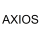

# Crypto Portfolio Tracker

## Coinbase   

Coinbase is an app that lets you buy and sell all sorts of cryptocurrencies, like Bitcoin, Ethereum, Litecoin and much more. You can also use Coinbase to convert one cryptocurrency to another, or to send and receive cryptocurrency to and from other people. 

## Uphold   

Uphold is another app that lets you buy, sell and trade cryptocurrencies. Uphold offers some of the same, but also different cryptos than Coinbase. 

Both Uphold and Coinbase offer a great developer portal for software engineers to develop apps based off of their respective platforms. For this project I have implemented the price endpoints offered by Coinbase and Uphold to find out specific cryptocurrency prices.  

## Purpose of the Project  

The purpose of this project was to be able to showcase my full stack capability. This Repository is home to the frontend part of the application written in JSX with React.  

Aside from being a demonstration for my current skills, I also used this as a way to enhance my knowledge by implementing new features and things that I had not yet worked with. User Authentication and Authorization were two of my priorities while building this.

### Features

- User Registration
- User Login
- Creating and adding User's crypto purchases to their portfolio.
- Removing User's crypto from their portfolio.
- Searching for crypto prices.

### **Things I learned throughout**

As I have already mentioned, authentication and authorization were two of my key focuses on this project. Something I had only previously studied, but never implemented. So I was very happy and fortunate to be able to use it in this project. 
I also was able to get a firm understanding and grasp with React Hooks. I was having an issue early on with rendering components while simultaneously trying to complete asynchronous requests. Once I understood that you cannot do this, I was able to more comprehend the power of React Hooks.

## Tech Stack

-  [React](https://react.dev/)
   

-  [JavaScript](https://www.javascript.com/)
   

-  [HTML](https://developer.mozilla.org/en-US/docs/Web/HTML)[CSS](https://developer.mozilla.org/en-US/docs/Web/CSS)
   

-  [MongoDB](https://mongodb.com/)
   

-  [Mongoose](https://mongoosejs.com/)
   

-  [Nodemon](https://nodemon.io/)
   

-  [Express](https://expressjs.com/)
   

-  [Axios](https://www.npmjs.com/package/axios)
   
